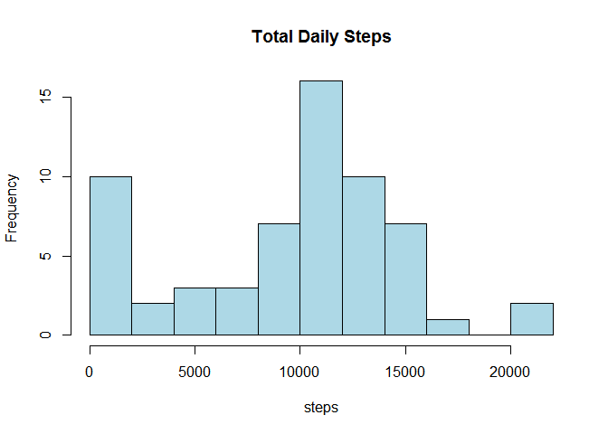
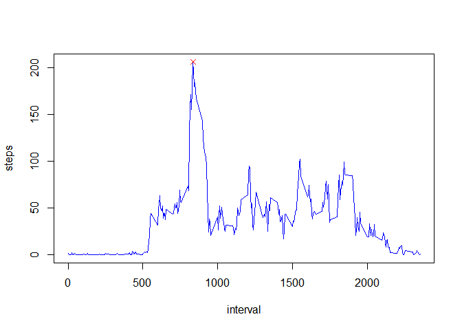
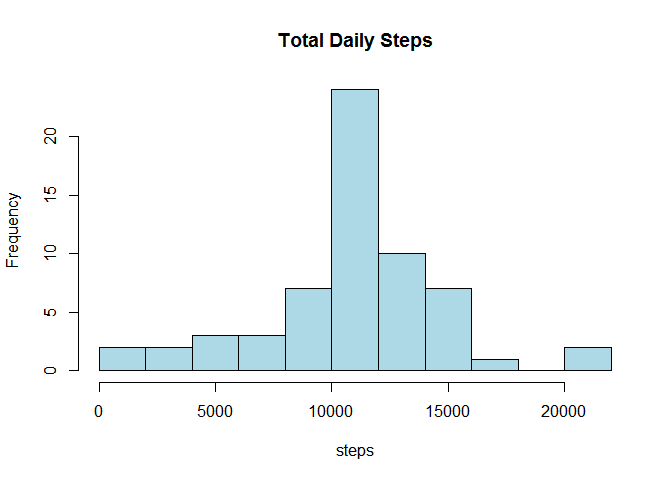
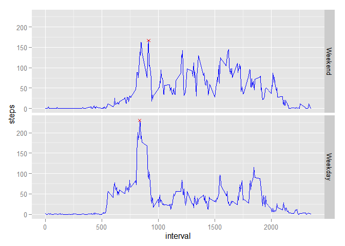

# Reproducible Research: Peer Assessment 1


## Loading and preprocessing the data
Set up libraries used in this analysis.

```r
library(plyr); library(dplyr); 
```

```
## 
## Attaching package: 'dplyr'
## 
## The following objects are masked from 'package:plyr':
## 
##     arrange, count, desc, failwith, id, mutate, rename, summarise,
##     summarize
## 
## The following object is masked from 'package:stats':
## 
##     filter
## 
## The following objects are masked from 'package:base':
## 
##     intersect, setdiff, setequal, union
```

```r
library(ggplot2)
```

Unzip "activity.zip" and load the data in file activity.csv.

```r
setwd("~/../datascience/RepData_PeerAssessment1")
fname <- unzip("activity.zip")
activity <- read.csv(fname)
```

Format the date column.

```r
activity <- mutate(activity, date=as.Date(date))
```

## What is mean total number of steps taken per day?
Create a histogram of daily step total, then calculate the mean and median.

```r
dailysteps <- activity %>% 
    group_by(date) %>% 
    summarize(steps=sum(steps, na.rm=TRUE)) 
hist(dailysteps$steps, breaks=10,
     col="lightblue", main="Total Daily Steps", xlab="steps")
```

 

```r
mean(dailysteps$steps)
```

```
## [1] 9354.23
```

```r
median(dailysteps$steps)
```

```
## [1] 10395
```

## What is the average daily activity pattern?
Also, which interval is the most active, on average?  
Line plot of average daily activity over time interval, with maximum marked with red X.

```r
activitypattern <- activity %>%
    group_by(interval) %>%
    summarize(steps=mean(steps, na.rm=TRUE))
mostactive.idx <- which.max(activitypattern$steps)
activitypattern$interval[mostactive.idx]
```

```
## [1] 835
```

```r
with(activitypattern, plot(interval,steps, type="l", col="blue"))
with(activitypattern, points(interval[mostactive.idx], 
       steps[mostactive.idx], 
       pch=4, col="red"))
```

 

## Imputing missing values
How many NAs are there?

```r
badvalues <- is.na(activity$steps)
sum(badvalues)
```

```
## [1] 2304
```

Use the mean for the respective 5-minute interval to impute these NAs. New data frame generated with imputed values. For Future work, add some intelligence to manage smoothing into adjacent known data.

```r
activity2 <- activity
getsteps <- function(intvl) {
    subset(activitypattern, interval == intvl, select = steps)
}
activity2$steps[badvalues] <- 
    as.numeric(sapply(activity2$interval[badvalues], getsteps))
```

Repeat the histogram, mean and median of total daily steps. Note the significant change in the number of 0-valued daily steps, without a significant change to the data's histogram. 

```r
dailysteps <- activity2 %>% 
    group_by(date) %>% 
    summarize(steps=sum(steps, na.rm=TRUE)) 
hist(dailysteps$steps, breaks=10,
     col="lightblue", main="Total Daily Steps", xlab="steps")
```

 

```r
mean(dailysteps$steps)
```

```
## [1] 10766.19
```

```r
median(dailysteps$steps)
```

```
## [1] 10766.19
```

This shows how removing NA values from data can skew summary data, especially when summing data points is involved. The mean and median values of a data set will be skewed  because the daily sum of data with points removed will be artificially reduced.

## Are there differences in activity patterns between weekdays and weekends?
Create a factor variable to discern between weekend and weekday, using the imputed data set.

```r
activity2 <- mutate(activity2, 
                    weekend=factor(weekdays(date) %in% c("Saturday","Sunday"),
                                   levels=c(TRUE,FALSE), 
                                   labels=c("Weekend","Weekday")))
```

Panel plot showing difference between weekend and weekday activity.

```r
activitypattern2 <- activity2 %>%
    group_by(weekend, interval) %>%
    summarize(steps=mean(steps))
peakactivity2 <- activitypattern2 %>%
    group_by(weekend) %>%
    summarize(Interval=interval[which.max(steps)], Steps=max(steps))
meanactivity2 <- activity2 %>%
    group_by(weekend, date) %>%
    summarize(steps=sum(steps)) %>%
    group_by(weekend) %>%
    summarize(steps=mean(steps))
gg <- ggplot(activitypattern2, aes(interval, steps)) + 
    facet_grid(weekend~.) + 
    geom_line(col="blue") +
    geom_point(data=peakactivity2, aes(Interval, Steps), 
               shape=4, color="red") 
print(gg)
```

 
